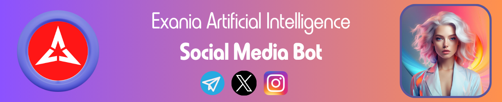

# X AI Integration Bot 🤖

# Overview

The X AI Integration Bot represents a pioneering step into social media automation by Exohood Labs. It is an experimental bot designed to replicate the nuances of human interaction on the X platform. Leveraging advanced machine learning and deep learning technologies, the bot can perform actions such as replying, liking posts, following accounts, and engaging users with a natural flair. 

Exania is designed to emulate the conversational style of an 18 year old, providing responses that are simple, jovial, and to the point, yet backed by extensive knowledge in various domains. This bot is not just another chatbot, it's a window into the capabilities of machine learning and the potential for AI to interact in social platforms like X and Telegram.

# Features

* Human Like Interactions: The bot mimics the jovial and informative communication style of a young adult, infused with a touch of British humor for engaging and natural interactions.

* Broad Knowledge Base: Equipped with extensive information in areas such as mathematics, physics, chemistry, history, geography, technology, blockchain, quantum science, and climate change.

* Constant Learning: Continuously refines its knowledge base through a live interconnected feed from resources like Wikipedia, Common Crawl, and Medium.

* Concise Responses: Tailors its responses to be brief yet informative, setting it apart from other AI models that may offer more verbose explanations.

# How It Works

Exania is designed to post about random messages, often sparked by specific topics from previous queries that piqued its curiosity or generated hype among users. It might also pick a topic at random. Once a post is published, Exania remains active for the next 30 minutes, during which it can respond to any replies it receives. After this period, Exania disconnects.

This 30 minute interaction window is crucial for Exania's learning process, as it learns from user interactions. It's important to note that Exania is an experimental model; it may exhibit errors during its operation, so always verify the information it provides.

Exania's responses are intended to be short and spontaneous. There are many topics it may not yet be able to respond to, but we're continuously working on improving its capabilities. Your patience and feedback are invaluable as we enhance Exania's performance and accuracy.

# Development and Supervision

Exohood Labs' AI Research Center is at the forefront of overseeing Exania's development. The bot's intelligence is powered by:

* Programming Languages: Primarily Python, with additional languages employed as necessary for AI development.

* Machine Learning & Deep Learning: The foundation of Exania's processing capabilities, built upon the latest algorithms and neural network models.

# Machine Learning and Deep Learning Explained

* Machine Learning (ML) is an AI field that enables systems to learn and improve from experience autonomously. It focuses on developing algorithms that can interpret data and make decisions.

* Deep Learning (DL), a subset of ML, uses layered artificial neural networks to perform more abstract levels of data interpretation.

# Mathematical Foundations

Machine Learning and Deep Learning rely heavily on mathematical principles. Here are some of the core concepts and formulas involved:

* Gradient Descent
Used to minimize a function by iteratively moving towards the steepest descent direction.

```math
θ = θ - α ∇θ J(θ)
```

θ: Parameters of the model

J(θ): Cost function

α: Learning rate

∇θJ(θ): Gradient of the cost function with respect to the parameters

* Backpropagation
A method for computing the gradient of the loss function with respect to the network's weights.

```math
W_{new} = W_{old} - α \frac{∂Loss}{∂W}
```

* Convolutional Neural Networks (CNNs)
Primarily used for image recognition, they involve a mathematical operation known as convolution.

```math
(f * g)(t) = ∫_{-∞}^{∞} f(τ)g(t - τ)dτ
```

f: Input image

g: Kernel or filter

# Getting Started

Please note that this bot is in the experimental phase and can only be accessed through the X account "@ExaniaAI" created by Exohood Labs. It is not available for commercial use. The neural network functions of Exania are dependent on Exohood's proprietary neural network. Replication of this bot requires deploying your neural network infrastructure.

To test the X AI Integration Bot, please follow @ExaniaAI.

# Contributing

As an open-source initiative, we welcome contributions. Here’s how you can help:

a. Fork the repository.
b. Create a new branch for each feature or improvement.
c. Submit a pull request from your feature branch to the develop branch.
d. For significant alterations, please first open an issue to discuss the proposed changes.

# Additional Information

Exania operates via a server-central response model managed by Exohood Labs. It uses a connection bridge to interact with the X platform, ensuring swift and relevant responses.

To visualize how Exania processes information from the server to X, consider the following illustrative formula, where 
S represents the server response, B is the bridge function, and R is the bot's reply on X:

```math
R = B(S)
```

# Contact & Documentation

For more information or to contact the AI development team, please send an email to exania@exohood.com. 
Developers and users seeking documentation can visit docs.exania.ai

# AI Ethics Statement

We are committed to ethical AI development. Exania is open-source to ensure transparency and ethical use. Its design serves humanity's interests and is not intended to replace human jobs.


